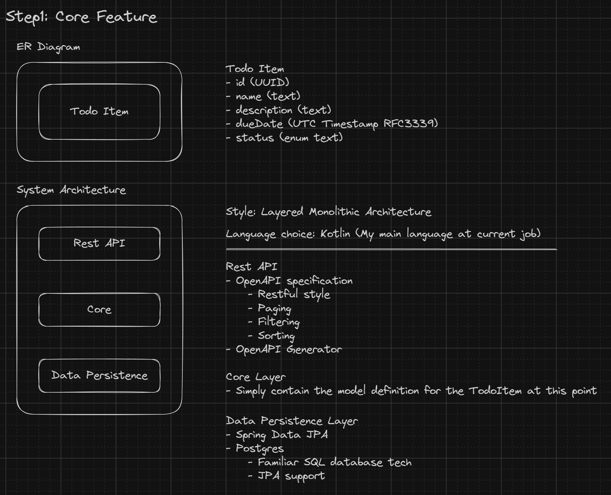

# Backend Design



## API designs

```yaml
openapi: 3.0.3
info:
  title: Todo Core API
  description: Core API for the Todo application
  version: 1.1.0
servers:
  - url: 'https://localhost:{port}'
    description: Local server
    variables:
      port:
        default: '8080'
        description: The port number

tags:
  - name: todos
    description: Operations related to todos

paths:
  /todos:
    get:
      summary: Get all todos
      operationId: getAllTodos
      tags:
        - todos
      parameters:
        - name: statuses
          in: query
          description: The statuses of the todos to filter by
          schema:
            type: array
            items:
              $ref: '#/components/schemas/TodoItemStatus'
        - name: dueDateStart
          in: query
          description: The start of the due date range to filter by
          schema:
            type: string
            format: date-time
        - name: dueDateEnd
          in: query
          description: The end of the due date range to filter by
          schema:
            type: string
            format: date-time
        - name: sort
          in: query
          description: The field to sort by
          schema:
            type: string
            enum:
              - name
              - status
              - dueDate
        - name: order
          in: query
          description: The order to sort by
          schema:
            type: string
            enum:
              - asc
              - desc
      responses:
        '200':
          description: A list of todos
          content:
            application/json:
              schema:
                type: array
                items:
                  $ref: '#/components/schemas/TodoItem'
    post:
      summary: Create a todo
      operationId: createTodo
      tags:
        - todos
      requestBody:
        required: true
        content:
          application/json:
            schema:
              $ref: '#/components/schemas/NewTodoItem'
      responses:
        '201':
          description: The created todo
          content:
            application/json:
              schema:
                $ref: '#/components/schemas/TodoItem'
  /todos/{id}:
    get:
      summary: Get a todo by ID
      operationId: getTodoById
      tags:
        - todos
      parameters:
        - name: id
          in: path
          required: true
          description: The ID of the todo
          schema:
            type: string
            format: uuid
      responses:
        '200':
          description: The todo
          content:
            application/json:
              schema:
                $ref: '#/components/schemas/TodoItem'
    put:
      summary: Update a todo
      operationId: updateTodo
      tags:
        - todos
      parameters:
        - name: id
          in: path
          required: true
          description: The ID of the todo
          schema:
            type: string
            format: uuid
      requestBody:
        required: true
        content:
          application/json:
            schema:
              $ref: '#/components/schemas/TodoItem'
      responses:
        '200':
          description: The updated todo
          content:
            application/json:
              schema:
                $ref: '#/components/schemas/TodoItem'
    delete:
      summary: Delete a todo
      operationId: deleteTodo
      tags:
        - todos
      parameters:
        - name: id
          in: path
          required: true
          description: The ID of the todo
          schema:
            type: string
            format: uuid
      responses:
        '204':
          description: The todo was deleted

components:
  schemas:
    TodoItem:
      type: object
      properties:
        id:
          type: string
          format: uuid
        name:
          type: string
        description:
          type: string
        dueDate:
          type: string
          format: date-time
        status:
          $ref: '#/components/schemas/TodoItemStatus'
      example:
        id: 'aa8970d2-8564-4f5a-8f4a-9e95a9b92298'
        name: 'Buy groceries'
        description: 'Buy milk, eggs, and bread'
        dueDate: '2021-12-31T23:59:59Z'
        status: 'NOT_STARTED'
    NewTodoItem:
      type: object
      properties:
        name:
          type: string
          x-field-extra-annotation: "@jakarta.validation.constraints.NotBlank"
        description:
          type: string
        dueDate:
          type: string
          format: date-time
        status:
          $ref: '#/components/schemas/TodoItemStatus'
      required:
        - name
        - status
      example:
        name: 'Buy groceries'
        description: 'Buy milk, eggs, and bread'
        dueDate: '2021-12-31T23:59:59Z'
        status: 'NOT_STARTED'
    TodoItemStatus:
      type: string
      enum:
        - NOT_STARTED
        - IN_PROGRESS
        - COMPLETED
```

## Database design

```sql
CREATE TABLE todo_items (
    id UUID PRIMARY KEY,
    name VARCHAR(255) NOT NULL,
    description TEXT,
    due_date TIMESTAMP WITH TIME ZONE,
    status VARCHAR(255) NOT NULL
);
```

## Next Step

- [ ] Add Todo List Model
- [ ] Implement Identity and Access Management (IAM)
- [ ] Implement Faceted Search Service
- [ ] Realtime Collaboration Service